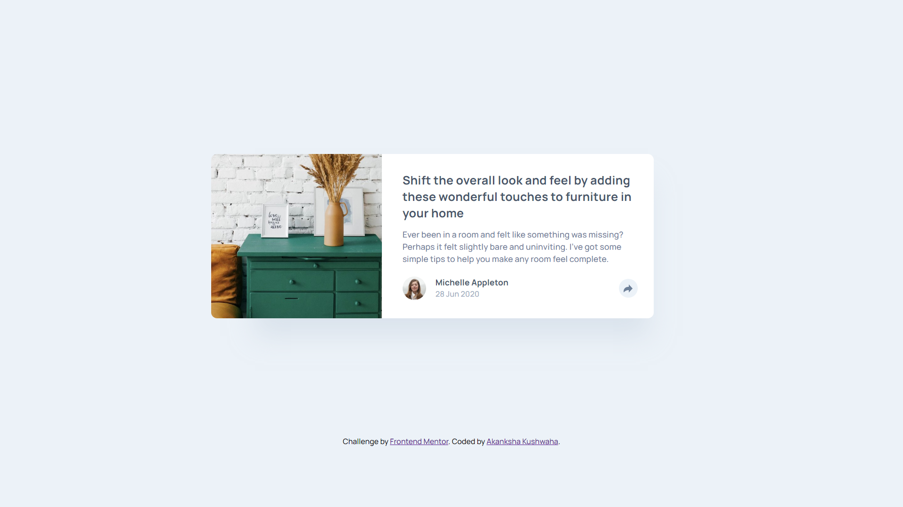

# Frontend Mentor - Article preview component solution

This is a solution to the [Article preview component challenge on Frontend Mentor](https://www.frontendmentor.io/challenges/article-preview-component-dYBN_pYFT). Frontend Mentor challenges help you improve your coding skills by building realistic projects. 

## Table of contents

- [Overview](#overview)
  - [The challenge](#the-challenge)
  - [Screenshot](#screenshot)
  - [Links](#links)
- [My process](#my-process)
  - [Built with](#built-with)
  - [What I learned](#what-i-learned)
  - [Continued development](#continued-development)
  - [Useful resources](#useful-resources)
- [Author](#author)

## Overview

### The challenge

Users should be able to:

- View the optimal layout for the component depending on their device's screen size
- See the social media share links when they click the share icon

### Screenshot

Desktop View

Mobile View

### Links

- Solution URL: [GitHub Repository](https://github.com/aku1310/article-preview-component-master)
- Live Site URL: [GitHub Pages](https://aku1310.github.io/article-preview-component-master/)

## My process

### Built with

- Semantic HTML5 markup
- CSS custom properties
- Flexbox

### What I learned

This was my first HTML & CSS based project where I implemented JavaScript as well. I learned more of HTML & CSS in this project in addition to the basics of JavaScript and how to implement it in HTML.

### Continued development

I would like to practice implementing JavaScript in HTML more and CSS Grid or my future projects.

### Useful resources

- [W3Schools](https://www.w3schools.com/css/) - This helped me in media query and active state for the JS implementation.
- [MDN Web Docs](https://developer.mozilla.org/en-US/docs/Web/CSS) - This resource helped me a lot in using flexbox and CSS.

## Author

- Frontend Mentor - [@aku1310](https://www.frontendmentor.io/profile/aku1310)
- LinkedIn - [Akanksha Kushwaha](https://www.linkedin.com/in/akankshakushwaha/)